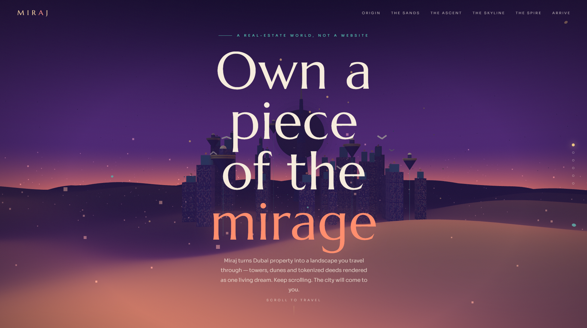

# 🌙 MIRAJ — A Real Estate World, Not a Website

An immersive 3D landing page where users **fly through a surreal, dreamlike Dubai** instead of scrolling through dashboards. Built with **Three.js + WebGL**, the entire experience is one continuous scroll-driven camera flight across dunes, floating tokenized villas, and a living skyline — emotion first, product second.

**[▶ Live Demo](https://ahmadncheema.github.io/Miraj/index.html)**

 <!-- add a screenshot or GIF named preview.png -->

---

## ✨ The Journey

Scrolling doesn't move a page — it moves a **camera** through six cinematic chapters:

| Chapter | Scene |
|---|---|
| **Origin** | Wide establishing shot — rose moon hanging over the city |
| **The Sands** | Camera dips low, skimming purple-and-gold desert dunes |
| **The Ascent** | Rises among floating islands — each one a fractional, on-chain property |
| **The Skyline** | Weaves between towers whose lit windows are live trading units |
| **The Spire** | Climbs a twisting hexagonal monolith to the summit, moon filling the frame |
| **Arrive** | Pulls back to reveal the whole world — and the call to action |

## 🦅 A Living World

- **7 falcons** with animated flapping wings circling the city
- **34 lanterns** rising endlessly into the night sky
- **Breathing moon** with a triple-layered glow halo
- **Pulsing beacons** on every tower crown
- **Procedural window textures** — every building glows uniquely
- **600 drifting sand-haze particles** + 900 stars
- **Mouse parallax** for subtle depth on every frame

## 🎬 Cinematic Techniques

- **Keyframed camera path** — position + look-at targets interpolated with cubic easing
- **Double-smoothed scroll** (scroll → progress → camera) for buttery motion
- **Scroll-synced overlay typography** — oversized Marcellus display type (up to 170px) fading in/out per chapter
- **Exponential fog, gradient sky dome shader, film grain + vignette** for the digital-painting look
- **Compass navigation** — dots and nav links fly the camera to any chapter

## 🛠 Tech Stack

- [Three.js r128](https://threejs.org/) — scene, lights, procedural geometry, shaders
- Vanilla **HTML / CSS / JS** — no frameworks, no build step
- Google Fonts — *Marcellus* (display) + *Sora* (body)
- **One single file.** Open `index.html` and you're flying.

## 🚀 Run It

```bash
git clone https://github.com/ahmadncheema/Miraj.git
cd Miraj
# open miraj-real-estate-world.html in any modern browser — that's it
```

Or serve locally:

```bash
npx serve .
```

**Enable GitHub Pages:** repo → Settings → Pages → Source: `main` branch, root. Tip: rename the file to `index.html` and the demo link becomes the clean `https://ahmadncheema.github.io/Miraj/`.

## ⚙️ Customize

All the magic lives in clearly-labeled blocks inside `miraj-real-estate-world.html`:

- **`KEYS` array** — edit camera positions/look-ats to redesign the flight path
- **`data-range="start,end"`** on each `.chapter` — controls when text appears along the scroll
- **`:root` CSS variables** — swap the twilight palette for your brand colors
- **`placeTowers()` / `island()`** — reshape the city and floating districts

## ♿ Quality Floor

- `prefers-reduced-motion` respected (animations damped, smooth-scroll disabled)
- Keyboard-focusable navigation with visible focus states
- Pixel ratio capped at 2× for mobile performance
- Responsive down to mobile widths

## 📄 License

MIT — fly free.

---

*Built as an experiment in environmental storytelling: replacing feature sections with places, dashboards with landscapes, and scrolling with travel.*
